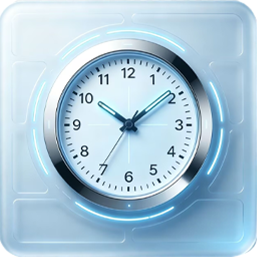
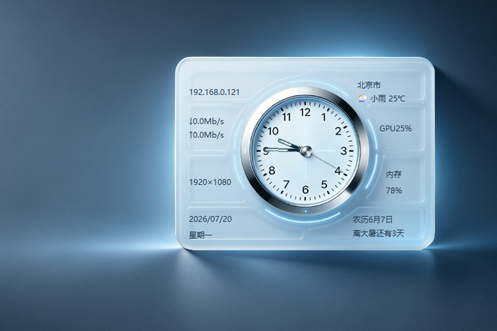
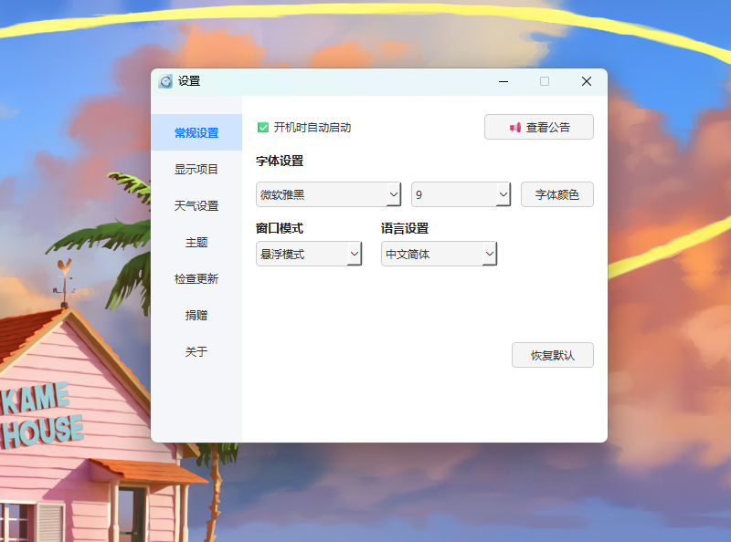
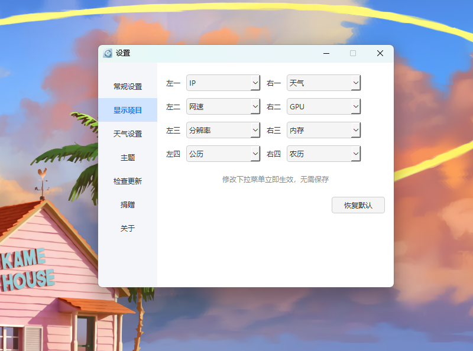
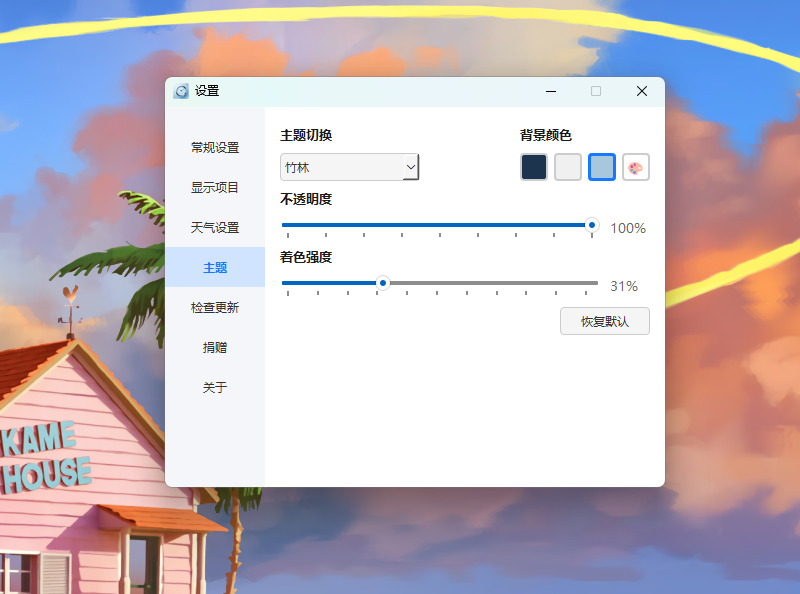
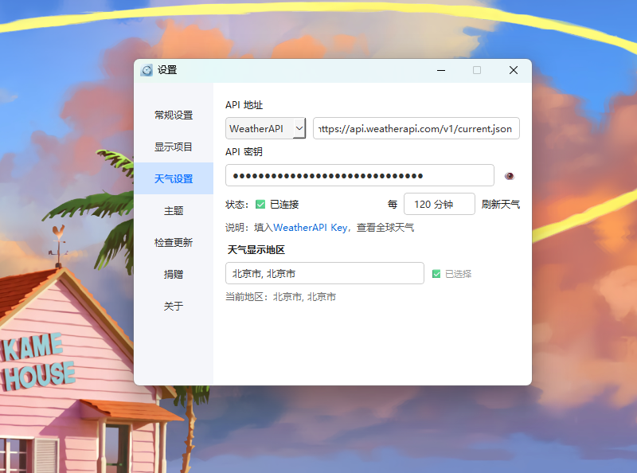
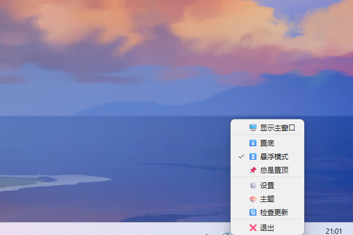
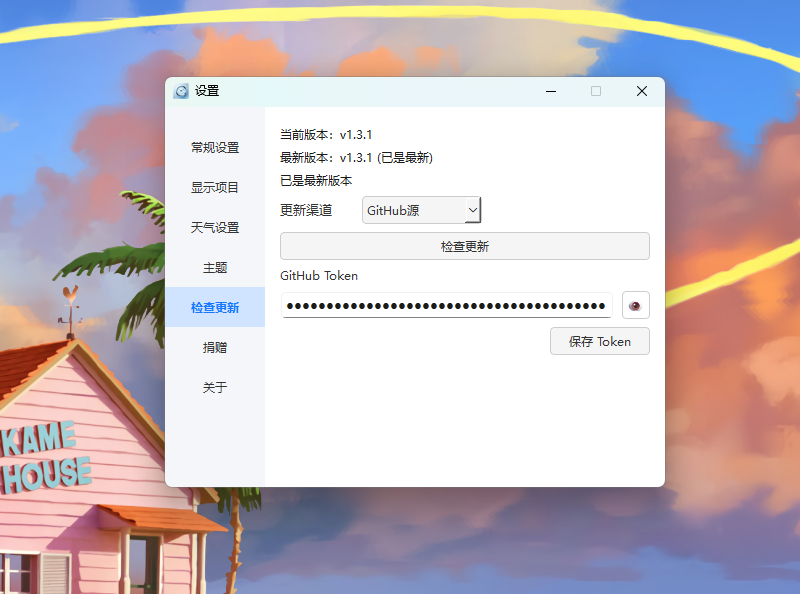

<p align="center">
  
</p>

<h1 align="center">🖥️ DesktopWidget</h1>

<p align="center">
A modern, lightweight and highly customizable desktop widget for Windows.
</p>

<p align="center">
Built with PyQt6 · Weather · System Monitor · Themes · Auto Update · 8 Languages
</p>

<p align="center">
  <a href="README.md"><strong>🇺🇸 English</strong></a> |
  <a href="README_CN.md"><strong>🇨🇳 简体中文</strong></a>
</p>

<!-- Project Badges -->
<p align="center">
  
  
  
  
</p>

<!-- Language Badges -->
<p align="center">
  
</p>

<p align="center">
  
  
  
  
  <br>
  
  
  
  
</p>

>## 🚀 Download

[](https://apps.microsoft.com/detail/9P6GSZ8NNW52?hl=zh-hans-cn&gl=CN&ocid=pdpshare)

[](https://github.com/Cherish95279/DesktopWidget/releases/latest)

[](https://gitee.com/Cherish95279/DesktopWidget/releases)

Released:
[](https://github.com/Cherish95279/DesktopWidget/releases/latest)

<p align="center">
  
</p>

---

## ✨ Overview

DesktopWidget is an all-in-one desktop widget application for Windows, designed to provide useful information at a glance while keeping your desktop clean and elegant.

It combines an analog clock, real-time weather, system monitoring, network speed monitoring, lunar calendar, solar terms, customizable themes, announcement management, and automatic updates into a single lightweight application.

Built with **PyQt6**, DesktopWidget focuses on performance, customization, and ease of use, making it suitable for both everyday users and enthusiasts.

---

## 🚀 Download

### 🏪 Microsoft Store (Recommended)

Install DesktopWidget directly from Microsoft Store:

[](https://apps.microsoft.com/detail/9P6GSZ8NNW52?hl=zh-hans-cn&gl=CN&ocid=pdpshare)

### ⬇️ Latest Release

[](https://github.com/Cherish95279/DesktopWidget/releases/latest)

[](https://gitee.com/Cherish95279/DesktopWidget/releases)


### Supported Systems

- Windows 10
- Windows 11
- Windows x64


### Installer

Download the latest Windows release package:

- Microsoft Store (Recommended)
- GitHub Release
- Gitee Release


---

## 📜 Changelog

DesktopWidget is actively maintained.

For the complete version history and detailed release notes, please see:

➡️ **[CHANGELOG.md](CHANGELOG.md)**

---

---

## ⭐ Why DesktopWidget?

DesktopWidget is designed for users who want a beautiful, informative, and customizable desktop experience.

### Lightweight

Built with Python and PyQt6, DesktopWidget provides useful desktop information without unnecessary complexity.

### Highly Customizable

Customize layouts, themes, fonts, colors, transparency, and displayed information to create your own desktop style.

### Global Weather Support

Supports multiple weather providers with global location search and flexible API configuration.

### Multilingual Interface

The complete user interface supports 8 languages, making DesktopWidget accessible to users around the world.

### Open Source

Released under the MIT License, allowing users to learn, modify, and improve the project.

---

# ✨ Features

## 🕐 Desktop Information

- **Analog Clock**
  - Smooth second-hand movement
  - Classic clock-style interface

- **Lunar Calendar & Solar Terms**
  - Displays lunar date information
  - Shows upcoming solar terms and countdown

- **Custom Layout**
  - 8 information slots
  - Freely arrange displayed components
  - Changes apply instantly without restarting

---

## 🌤 Weather System

DesktopWidget provides a flexible weather system with multiple service providers.

Supported weather services:

- Open-Meteo
- Amap Weather
- QWeather
- Weather API
- Custom Weather API

Features:

- Global city search
- Multi-language location search
- Latitude and longitude based weather queries
- User-configurable API keys
- Custom weather URL support
- Adjustable refresh interval

The weather system can be used without an API key through Open-Meteo, while advanced users can configure professional weather services.

---

## 📊 System Monitoring

Real-time system information display:

- CPU usage
- GPU usage
- Memory usage
- Network upload speed
- Network download speed

Monitoring information is updated automatically with configurable refresh intervals.

---

## 🎨 Themes & Appearance

Personalize your desktop widget with:

- Built-in themes:
  - Default Theme
  - Bamboo Theme

- Customizable:

  - Background color
  - Transparency
  - Theme intensity
  - Font
  - Font size
  - Text color

Theme changes apply instantly.

---

## ⚙ System Features

DesktopWidget includes practical system functions:

- System tray support
- Minimize to tray
- Show/hide window from tray
- Startup with Windows
- Automatic update checking
- Remote announcement notifications

---

## 🌍 Localization

DesktopWidget provides a fully translated interface:

Supported languages:

| Language | Status |
| --- | --- |
| English | ✅ |
| 简体中文 | ✅ |
| 繁體中文 | ✅ |
| 日本語 | ✅ |
| 한국어 | ✅ |
| Deutsch | ✅ |
| Français | ✅ |
| Español | ✅ |

All user-visible interface text has been localized.

---

# 🖼 Screenshots

## Main Window

### Default Theme



### Bamboo Theme


---

## Settings

### General Settings



### Display Items



### Theme Settings



### Weather Settings



---

## System Tray



---

## Update System



---

---

# 🏗️ Architecture

DesktopWidget is built with a modular architecture based on Python and PyQt6.

## Technology Stack

| Technology | Purpose |
| --- | --- |
| Python 3.12 | Core programming language |
| PyQt6 | GUI framework |
| psutil | CPU / Memory / Network monitoring |
| GPUtil | GPU monitoring |
| requests | Network communication |
| zhdate | Lunar calendar conversion |
| Pillow | Image processing |
| PyInstaller | Application packaging |
| Inno Setup | Windows installer creation |

---

## Project Structure

The project uses a modular design:

```text
DesktopWidget/
│
├── src/
│   ├── widgets/              # Core components
│   ├── settings_pages/       # Settings interface
│   ├── mixins/               # Feature extensions
│   ├── notice/               # Announcement system
│   └── i18n/                 # Localization system
│
├── screenshots/              # Preview images
├── icons/                    # Application icons
├── skins/                    # Theme resources
├── tools/                    # Build and release tools
│
├── widget.py                 # Application entry point
├── LICENSE                   # MIT License
└── README.md
```

The modular architecture makes DesktopWidget easier to maintain, extend, and customize.

---

# 🛠️ Development

## Requirements

- Windows 10 / Windows 11
- Python 3.12+

## Run From Source

Clone the repository:

```bash
git clone https://github.com/Cherish95279/DesktopWidget.git

cd DesktopWidget
```

Create a virtual environment:

```bash
python -m venv .venv
```

Install dependencies:

```bash
pip install PyQt6 psutil requests zhdate GPUtil Pillow
```

Run:

```bash
python widget.py
```

---

## Build Release Package

DesktopWidget uses:

- **PyInstaller** for executable packaging
- **Inno Setup** for Windows installer creation

The official release package:

```text
Latest DesktopWidget release package
```

---

# 🗺️ Roadmap

## Completed ✅

- ✅ Analog clock system
- ✅ Weather system
- ✅ Multiple weather providers
- ✅ Global city search
- ✅ Theme customization system
- ✅ Custom layout system
- ✅ CPU / GPU / Memory monitoring
- ✅ Network speed monitoring
- ✅ Announcement system
- ✅ Automatic update system
- ✅ 8-language localization
- ✅ GitHub / Gitee release support
- ✅ Microsoft Store distribution
- ✅ MSIX packaging

---

## Future Plans 🚧

- [ ] GitHub Actions automated build and release
- [ ] More theme resources
- [ ] Further performance optimization
- [ ] More customizable desktop components

---

---

# 🔒 Privacy

DesktopWidget respects user privacy.

DesktopWidget does not require an account and does not collect personal information such as names, email addresses, personal files, passwords, or private content.

To improve application stability and user experience, DesktopWidget may collect limited anonymous technical and usage statistics, such as:

- Application version
- Operating system information
- Feature and configuration status
- Anonymous usage statistics

Some network information may be used to generate anonymous country/region statistics. IP addresses are not stored, and precise location information is not collected.

Collected data is used only for:

- Improving application stability
- Fixing compatibility issues
- Understanding feature usage
- Improving user experience

DesktopWidget does not sell or share user data for advertising purposes.

For the complete privacy policy, please visit:

https://github.com/your-username/DesktopWidget/blob/main/PRIVACY.md

# 🤝 Contributing

Contributions are welcome.

You can contribute by:

- Reporting bugs
- Suggesting new features
- Improving translations
- Submitting code improvements

DesktopWidget is also open for learning, modification, and secondary development.

Please use GitHub Issues or Discussions for feedback and suggestions.

---

# 📄 License

DesktopWidget is released under the **MIT License**.

You are free to:

- Learn from the source code
- Modify the project
- Create derivative works
- Use it for personal or commercial purposes

See the full license:

[LICENSE](LICENSE)

---

# 💖 Support Development

DesktopWidget is free and open source.

If you find this project useful, you can support its continued development through PayPal.

<a href="https://paypal.me/Cherish95279">
  
</a>

<br>

### PayPal QR Code


Or use PayPal.Me:

<a href="https://paypal.me/Cherish95279">  </a>

Your support helps maintain and improve DesktopWidget.

Thank you! ❤️

---

# 👤 Author

Created by **Cherish95279**

GitHub:

https://github.com/Cherish95279

---